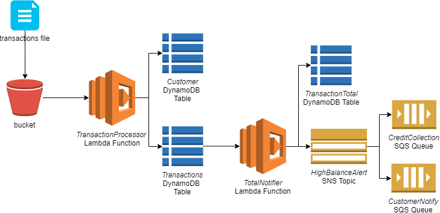

# aws_snsexample_terraform
AWS example in Terraform leveraging SNS & SQS. This example will receive a transactions file, load its contents into a database and send notifications if required



### How Does it work?
1. You will upload a transactions file to an S3 bucket
2. This will be read by the TransactionProcessor lambda function that adds values to the Customer & Transactions DynamoDB tables
3. The TotalNotifier lambda function will calculate values from the Transactions DynamoDB table and write them to the TransactionsTotal table. Additionally it will also send an alert to the HighBalanceAlert SNS topic (of which the CreditCollection and CustomerNotify SQS queues are subscribed to) for any account balances over $1500


### Usage
#### Step 1 - Credentials
You will need to update value **shared_credentials_file** in variables.tf with your credential file location. Feel free to change the region as you desire.

#### Step 2 - Terraform Run
Change the current directory to `aws_snsexample_terraform` and execute the following  
```
$ terraform init
$ terraform plan
$ terraform apply
```

#### Step 3 - Upload Transactions File
Login to AWS and access the S3 bucket mentioned in the output of Step 2. Upload file transactions.txt

#### Step 4 - View Notifications
Browse the CreditCollection or CustomerNotify SQS queue for messages. 1 message will appear if the transaction file has been successfully processed.

### Cleanup Tasks
When complete make sure to destroy your resources to minimise further charges!

```
terraform destroy
```